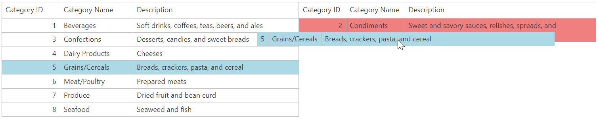

# Grid View for ASP.NET MVC - How to use jQuery to drag and drop items from one grid to another
<!-- run online -->
**[[Run Online]](https://codecentral.devexpress.com/t116869/)**
<!-- run online end -->

This example demonstrates how to use the jQuery framework to drag rows between grids.



## Overview

Create a callback panel and two grid controls. Use jQuery UI [Draggable](https://jqueryui.com/draggable) and [Droppable](https://jqueryui.com/droppable) plug-ins and define `draggable` and `droppable` items.

```cshtml
settings.Styles.Table.CssClass = "droppableRight";
settings.Styles.Row.CssClass = "draggableRow right";
```

Handle the panel's client-side `EndCallback` event. In the handler, use the corresponding jQuery selectors to initialize the specifed `draggable` and `droppable` items. Use the `start` event handler to obtain the dragged row's key value and apply style settings to that row based on a condition.

```js
start: function (ev, ui) {
    var $sourceElement = $(ui.helper.context);
    var $draggingElement = $(ui.helper);
    var sourceGrid = ASPxClientGridView.Cast($draggingElement.hasClass("left") ? "gridOne" : "gridTwo");

    // Add styles
    $sourceElement.addClass("draggingStyle");
    $draggingElement.addClass("draggingStyle");
    $draggingElement.width(sourceGrid.GetWidth());

    // Find the row's key value
    rowKey = sourceGrid.GetRowKey($sourceElement.index() - 1);
}
```

Handle the `drop` event of the `droppable` items to send a callback to the callback panel to configure the grid's edit functionality.

## Files to Review

* [HomeController.cs](./CS/dragDropMvc/Controllers/HomeController.cs) (VB: [HomeController.vb](./VB/dragDropMvc/Controllers/HomeController.vb))
* [GridModel.cs](./CS/dragDropMvc/Models/GridModel.cs) (VB: [GridModel.vb](./VB/dragDropMvc/Models/GridModel.vb))
* [script.js](./CS/dragDropMvc/Scripts/script.js) (VB: [script.js](./VB/dragDropMvc/Scripts/script.js))
* [_CallbackPanelPartial.cshtml](./CS/dragDropMvc/Views/Home/_CallbackPanelPartial.cshtml)
* [_GridOne.cshtml](./CS/dragDropMvc/Views/Home/_GridOne.cshtml)
* [_GridTwo.cshtml](./CS/dragDropMvc/Views/Home/_GridTwo.cshtml)
* [Index.cshtml](./CS/dragDropMvc/Views/Home/Index.cshtml)

## More Examples

* [Grid View for ASP.NET Web Forms - How to use jQuery to drag and drop items from one grid to another](https://github.com/DevExpress-Examples/asp-net-web-forms-grid-use-jquery-to-drag-and-drop-rows)
